# Introduction

The enigma machine is an analog cipher device invented by German engineer Arthur Scherbius in 1918. It is most famous for being used by Nazi Germany during WWII to encrypt secret messages. The enigma was broken by the Polish which decrypted enigma traffic on a continuous basis before being invaded by the Germans 1939. The British (and the French) continued and reproduced the work of the Polish by building the Bombe machine at Bletchley Park to decipher enigma messages, effectively shortening the war by years.


Sources:   
https://en.wikipedia.org/wiki/Enigma_machine   
https://en.wikipedia.org/wiki/Bombe


# Enigma Machine Theory
This section describes the core components of the enigma machine and how these jointly operate to produce encrypted letters. The description is emphasized on encryption logic such that the reader can understand the source code better. The reader is referred to the internet for details not discussed here. One tip is the "How did the Enigma work?" youtube video (See sources below), explaining the machine's electromechanics in detail.


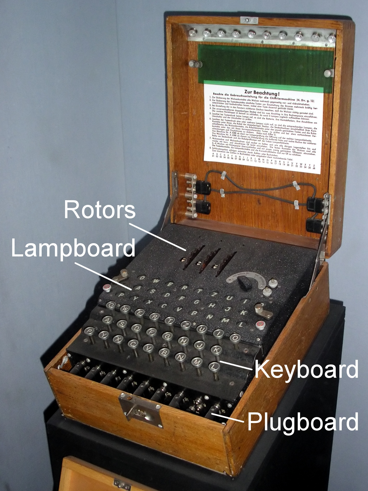

*Figure 1. Labeled Enigma machine.*

Figure 1 displays the complete enigma machine highlighting some of its components. To encrypt a message, the user types letters on the keyboard, which sends a current through the machine that activates lamps on the lampboard, highlighting the encrypted letters.

To decrypt a message, the user must configure the plugboard and rotors identically to the state before the message was encrypted. The user then types the encrypted letters which inverts the encryption process and produces the original message.

The encryption process in the enigma machine is essentially a series of letter substitutions were the substitution rules/configuration changes contiuously after each keypress, making it hard to predict the next encrypted letter. The upcoming sections describes how this substitution is made by explaining how the encryption components configures and changes the path of the current which ultimately decides which letter is lit on the lampboard.


Sources:   
Figure 1 - https://en.wikipedia.org/wiki/Cryptanalysis_of_the_Enigma#/media/File:EnigmaMachineLabeled.jpg     
How did the Enigma work? - https://www.youtube.com/watch?v=ybkkiGtJmkM&t=443s  
Wiki page - https://en.wikipedia.org/wiki/Enigma_machine.  


## Plugboard
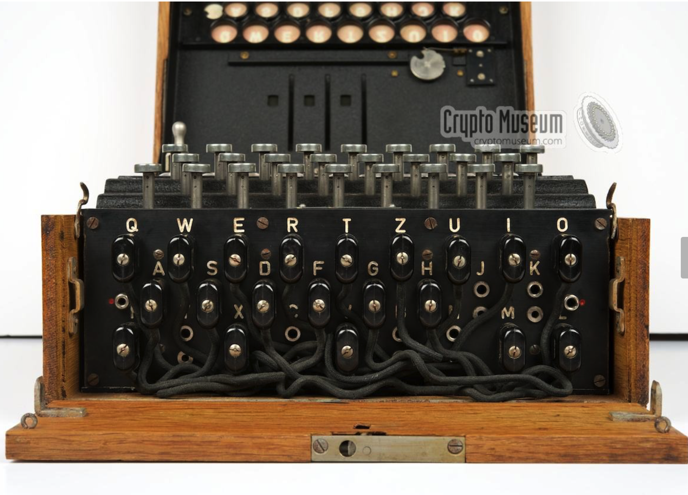

*Figure 2. Plugboard.*

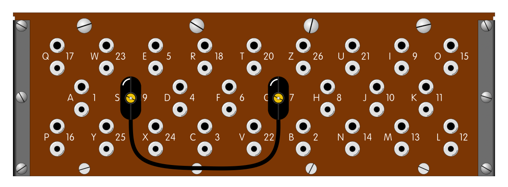

*Figure 3. Cord connecting S and O.*

The plugboard in figure 2 is the first component that substitutes letters. The board composes 26 outlets, each representing a letter from the latin alphabet, that can be connected in pairs using cords. Figure 3 displays a trivial plugboard configuration where one chord is used to connect S with O. This means that if the user types S, the current will travel to the S-outlet in the plugboard, which directs the current through the cable into the O-outlet, resulting in O as the output, and vice versa. If a outlet has no cord, the corresponding letter is simply mapped to itself.

The plugboard is configurable as the user can choose how to connect letters using a set of cords as displayed in Figure 2.

Sources:   
https://www.cryptomuseum.com/crypto/enigma/i/index.htm - Figure 2, etc
https://www.cryptomuseum.com/crypto/enigma/i/sb.htm - Figure 3, etc   

## Rotors

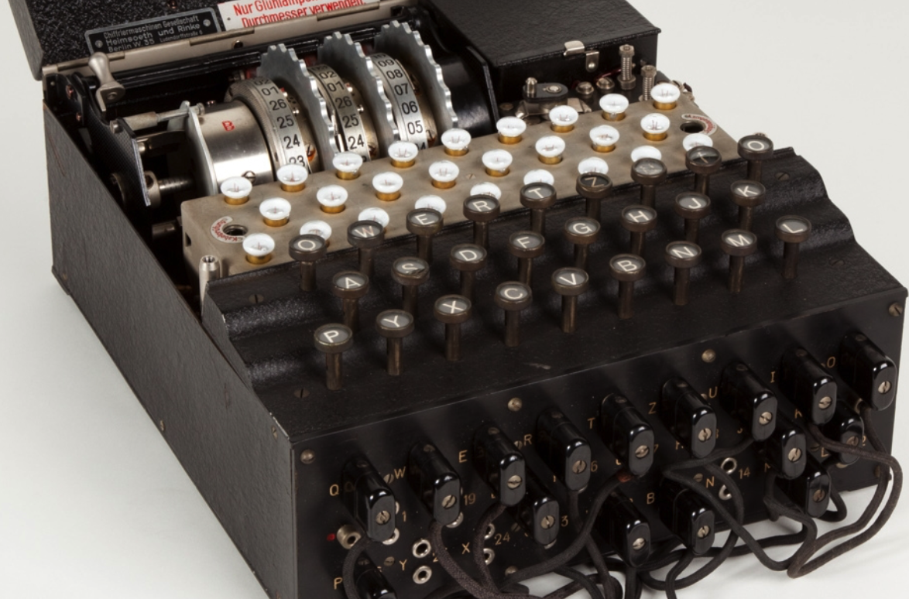

*Figure 4. Enigma under the hood.*

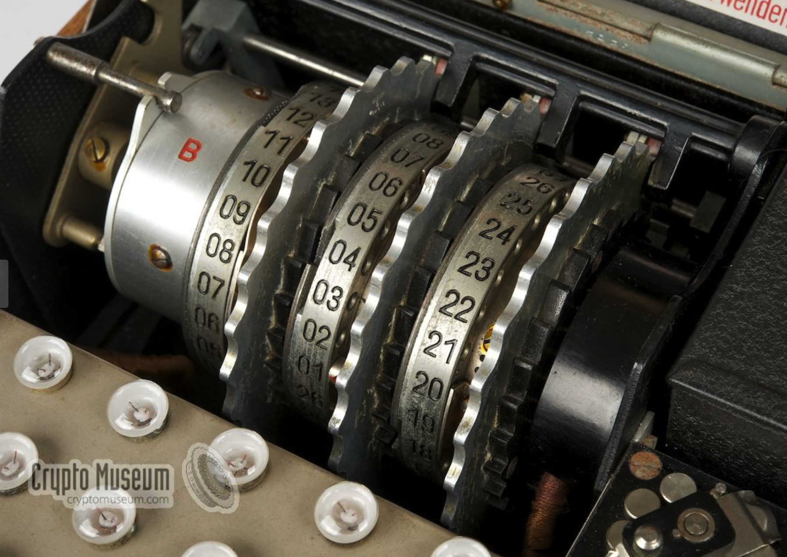

*Figure 5. Rotors up close.*

After the plugboard, the current travels through the rotors displayed in Figure 4 and 5.

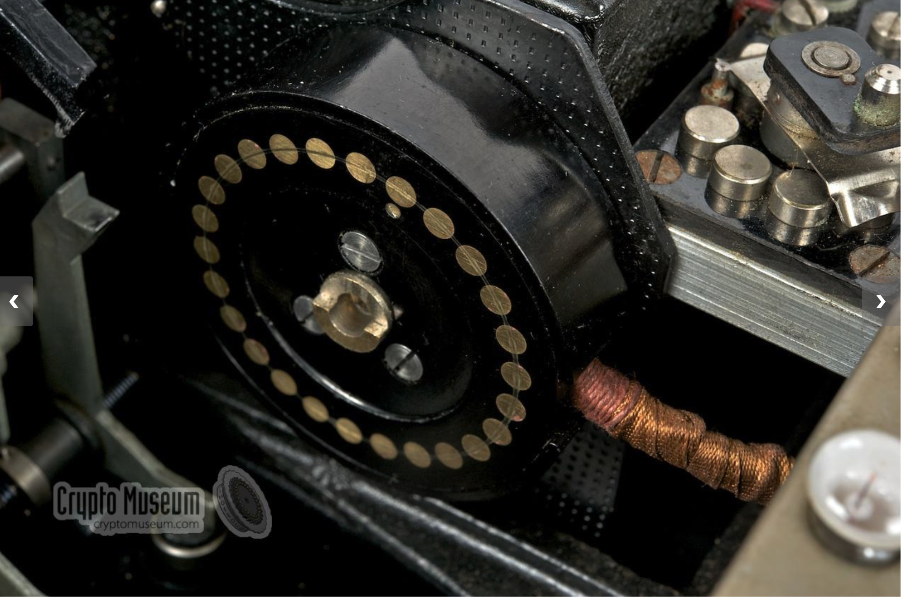

*Figure 6. Back cylinder, up close.*

The current starts by traveling through one of the outlets in the black cylinder (Figure 6) adjacent to the rotor furthest to the right in Figure 5.

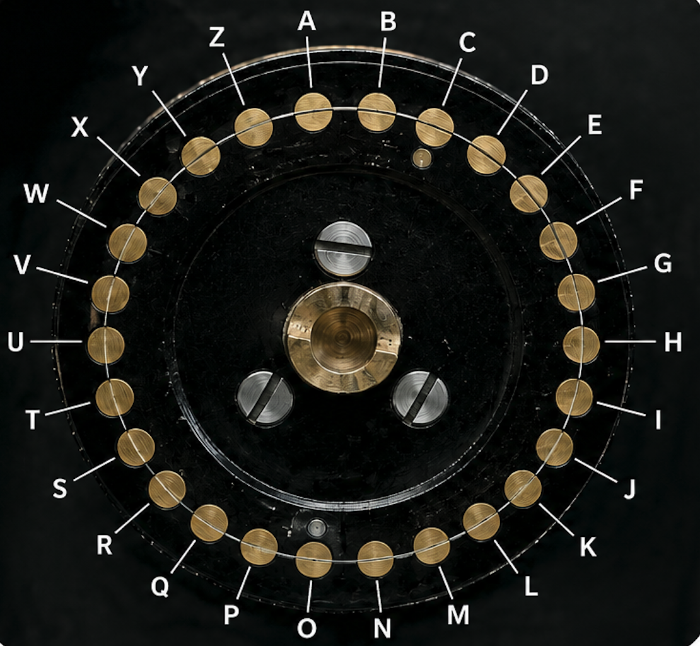

*Figure 7. Back cylinder outlets with corresponding letters. AI generated using Figure 6.*

The cylinder has 26 outlets, each representing a letter in the alphabet as illustrated in Figure 7. This means that the outgoing O-current in the plugboard section will travel through the O-output in Figure 7.

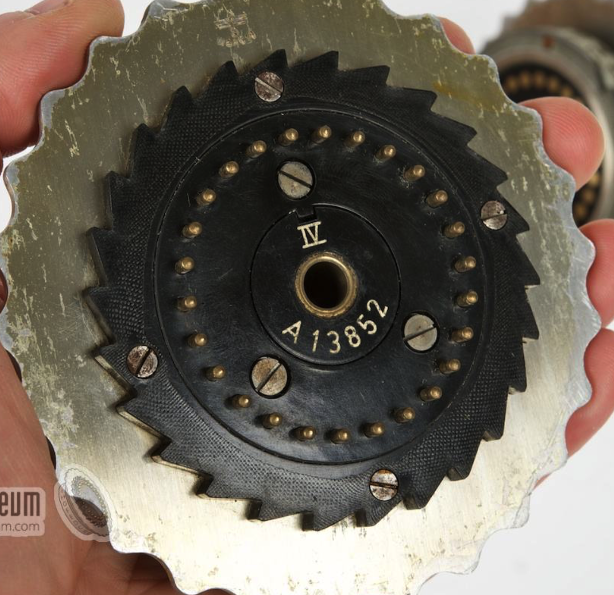

*Figure 8. Rotor pins. Right side of the rotor*

The outlets in Figure 6 are connected to the rotor pins in Figure 8 were the pins represents alphabetic letters similar to the outlets in the black cylinder.

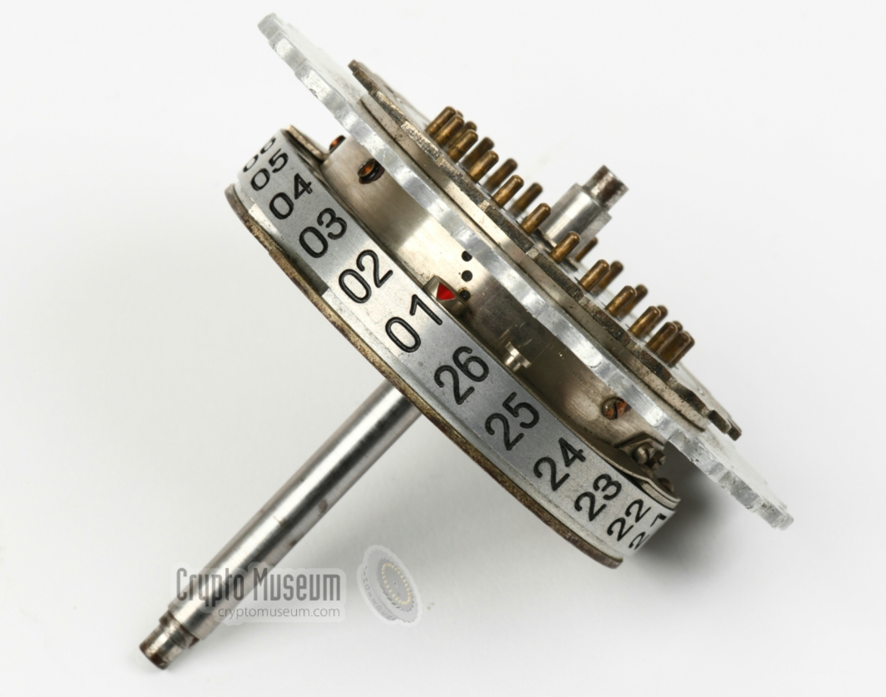

*Figure 9. Rotor from the side.*

A rotor has numbers (letters) ranging from [1, 26] ([A-Z]) as shown in Figure 9, representing different rotor configurations that can be set by turning the rotor. A configuration decides how pins connect to the outlets to its right, meaning if right-most rotor is configured to 2 (B), then outgoing letter A in the cylinder enters as B in the rotor since the B pin is connected to the A outlet. We say that A is shifted by 1 here since the rotor configuration defines how many steps entering letters are shifted to the right in the alphabet (see ILLUSTRATION 1), similar to how the Ceasar cipher operates.

```bash
ILLUSTRATION 1:

ABCDEFGHIJKLMNOPQRSTUVWXYZ - A enters
|
V
BCDEFGHIJKLMNOPQRSTUVWXYZA - Fast rotor is configured to 2, connecting A outlet with B pin. A is hence shifted by 1.
```

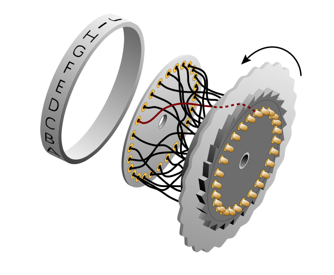

*Figure 10. Rotor wiring.*

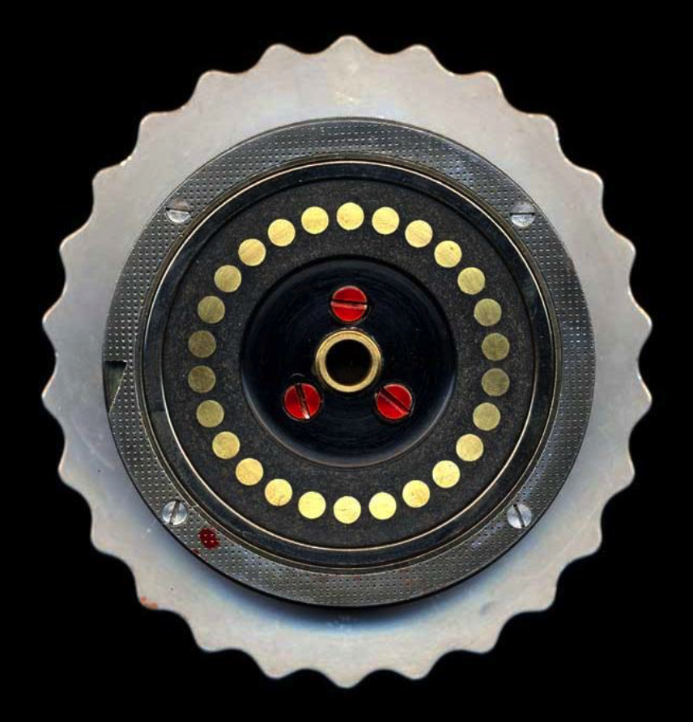

*Figure 11. Rotor outlets. Rotor from the left side.*

The current continues by traveling through the wiring inside the rotor that connects the pins on its right side to the outlets on its left side (see Figure 10 and 11). The wiring defines a mapping between alphabetic letters, which can be represented by a permutation of the alphabet as illustrated in ILLUSTRATION 2.

```bash
ILLUSTRATION 2

ABCDEFGHIJKLMNOPQRSTUVWXYZ
QJXRMPLVOGSIBZTEWCKUYAFNDH

A maps to Q, B to J, and so on...
```

Since B was the entering letter in our example, B becomes J according to the wiring in the illustration. The current then travels to the pin connected to the J-outlet and the process explained above repeats. 

## Turning the rotors

The rotors are most commonly attached in sequences of three. The rotors from left-to-right in Figure 5 are called slow, middle, and fast rotor because of how frequenctly each turn. Each rotor has a notch that defines when a full turn is made, triggering the rotor to its rigth to turn one step. The fast rotor turns every time a letter is typed, and triggers the middle rotor to turn one step once it has made one full turn. The turning of the rotors are analogous to the clock. The slow, middle, and fast rotors correspond to the hour, minute, and second hands.

https://www.youtube.com/watch?v=-qcOCBfRRzg illustrates some rotations 0:24 for reference.

Sources:   
https://en.wikipedia.org/wiki/Enigma_machine#/media/File:Enigma_(crittografia)_-_Museo_scienza_e_tecnologia_Milano.jpg - Figure 4   
https://www.cryptomuseum.com/crypto/enigma/i/index.htm - Figure 5, 6, and 8  
https://www.cryptomuseum.com/crypto/enigma/wiring.htm - Figure 9   
https://www.cryptomuseum.com/crypto/enigma/working.htm - Figure 10   
https://en.wikipedia.org/wiki/Enigma_rotor_details - Figure 11   


## Reflector

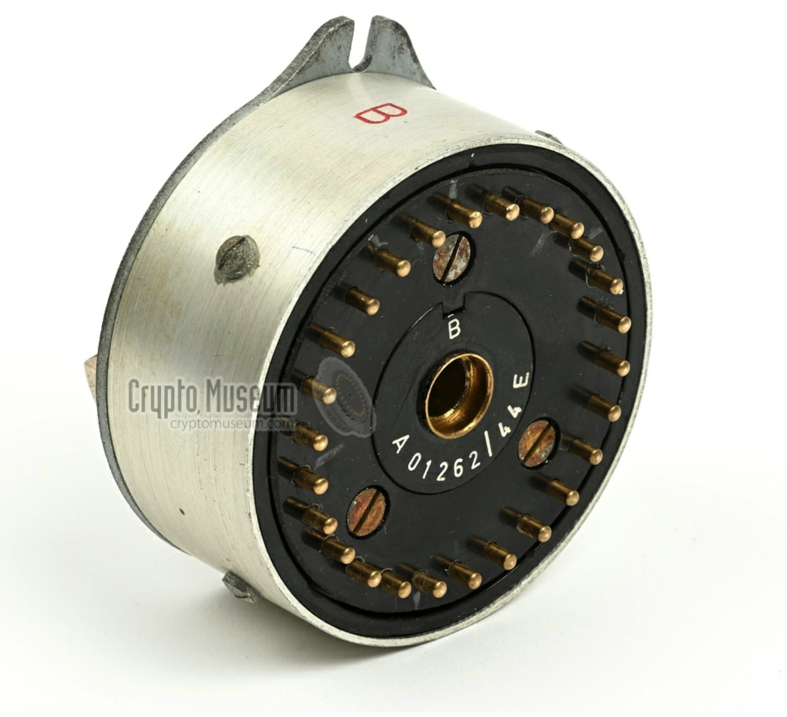

*Figure 12. The reflector component.*

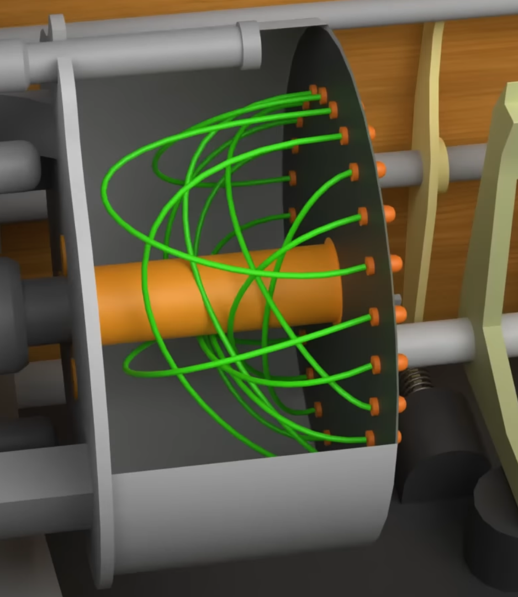

*Figure 13. Reflector wiring.*

The reflector is a encryption component attached to the left of the slow rotor in Figure 5. It connects alphabetic letters, similar to the plugboard, in 13 unique pairs that are fixed. Figure 13 illustrates how letters are connected by connecting their corresponding pins using internal wiring. An outgoing letter from the slow rotor will enter one of the refelector pins that directs the current to a different which then travels back to the slow rotor.

Sources:   
https://www.cryptomuseum.com/crypto/enigma/wiring.htm - Figure 12   
https://www.youtube.com/watch?v=ybkkiGtJmkM&t=385s - Figure 13   

## Encryption process

Now that the reader knows all encryption components in the enigma machine, the full encryption process can be outlined.

```Bash
KEYBOARD (1)
|
V
PLUGBOARD (2)
|
V
ROTORS (passing through fast, middle, and slow rotor) (3)
|
V
REFLECTOR (4)
|
V
ROTORS (in reversed order) (5)
|
V
PLUGBOARD (6)
|
V
LAMPBOARD (7)
```

1. Letter is entered.
2. Plugboard makes first substitution. If letter is not corded, the letter maps to itself.
3. Resulting letter passes through all rotors right-to-left.
4. Resulting letter passes through the reflector.
5. Resulting letter passes throught he rotors right-to-left. No rotations are made. 
6. Passes through the Pluboard.
7. Light activates on lampboard, highlighting the encrypted letter.

Sources:   
https://en.wikipedia.org/wiki/Enigma_machine - See Electrical Pathway section.

# Python project

This section explains the project as a whole, including source code package strucutre, project setup, etc.

## Source code

The source code is organized in the following packages:
* enigma_machine - Root package containing the enigma machine implementation.
* _internals - Utility package containing tools that other packages can use.
* _reflector - Package for reflector related functionality.
* factory    - Package for storing pre-configured enigma machines. 
* plugboard  - Package for plugboard related functionality.
* rotor      - Package for rotor related functionality.


## Project setup

The user can set up the project using poetry or python >= 3.14 and pip.

### Poetry
```bash
poetry sync # Assumes that poetry is configured to build your virtual enviroment in a folder from which 'poetry sync' is executed.
poetry install --extras dev # Optional. Includes dependencies for testing and linting.
source .venv/bin/activate # MAC
./.venv/Scripts/activate  # WINDOWS
```
### Python and pip
```bash
python -m venv .venv # assumes that 'python' points to a >=3.14 interpreter on your system
source .venv/bin/activate # MAC
./venv/Scripts/activate # WINDOWS
pip install .
pip install ".[dev]" # Optional. Needed if there is interest in running linting and tests.
```

### Running linting, tests and demo

Once setup is complete, the reader can test if your virtual enviroment can run *demo.py* by executing
```bash
python src/enigma_machine/demo.py
```

The reader can also run tests and linting by exeucting
```bash
python -m pytest
python -m ruff check
python -m mypy
```

## Installing the project as a dependency

This project can be installed as a dependency from PyPI by running
```bash
pip install enigma-machine-py
```


## Example usage
The following code snippet show how you can build your own enigma machine and use it to encrypt and decrypt messages. The reader is encouraged to read the documentation in the source code for details.
```python
from enigma_machine import EnigmaMachine

machine = EnigmaMachine(
    rotors=(
        "WBOSQNZJHEAMFYKTRUIDCGXLVP",
        "HFQATKXPNYVCLIZRSEUGMBWODJ",
        "QJXRMPLVOGSIBZTEWCKUYAFNDH",
    ),
    reflector_wiring="LCYUGRWPAZFVDJQIXSOBETNMHK",
    plugboard=[
        ("A", "D"),
        ("B", "Q"),
        ("C", "M"),
        ("E", "Z"),
        ("F", "L"),
        ("G", "X"),
        ("H", "P"),
        ("I", "T"),
        ("J", "N"),
        ("K", "W"),
    ]
)

message = "Hello there."

machine.rotor_setting = (1, 2, 3)
encoded_message = machine.encode_message(message)

machine.rotor_setting = (1, 2, 3)
decoded_message = machine.encode_message(encoded_message)

print(f"Original message: {message}")        # Hello there.
print(f"Encoded message: {encoded_message}") # JJICQOLJAI
print(f"Decoded message: {decoded_message}") # HELLOTHERE
```

The reader can also use prepared enigma machines for convenience:
```python
from enigma_machine.factory import create_enigma_i_machine

message = "Hello there."

enigma_i = create_enigma_i_machine()

enigma_i.rotor_setting = (3, 4, 2)
encoded_message = enigma_i.encode_message(message)

enigma_i.rotor_setting = (3, 4, 2)
decoded_message = enigma_i.encode_message(encoded_message)

print(f"\nOriginal message: {message}")      # Hello there.
print(f"Encoded message: {encoded_message}") # KPNDFJRFMA
print(f"Decoded message: {decoded_message}") # HELLOTHERE
``` 

# AI usage

AI usage was very limited in this project as I like to rely on my own problem solving skills when working on programming projects as a hobby. I have occasionally used ChatGPT to clarify details of how the enigma machine operates, discuss design patterns, generating images in this README for illustration purposes, and some lines in the toml file. Apart from that, the source code is entirely produced by me, along with the unit tests, README file, etc.